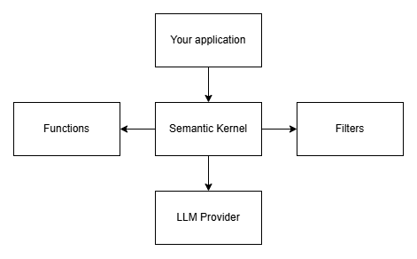
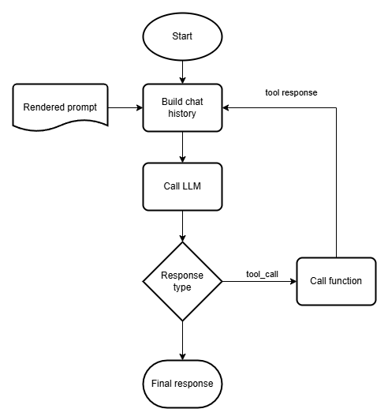

import { Aside, Steps } from "@astrojs/starlight/components";

In this first module, we will learn how to use a large language model with Semantic Kernel.
By the end of this module, you'll:

- Understand how a large language model works from a conceptual standpoint.
- Understand the basic concepts of Semantic Kernel.
- Be able to apply the basic concepts of Semantic Kernel to build an agent.

We'll learn these things by building the fundamentals of an agent that can answer a
user's questions based on the knowledge we've provided to the agent. For now, we'll
focus on creating a basic chat agent; in later modules, we'll extend its behavior with
tools to make it more powerful.

Let's begin by understanding the basics of a large language model.

## Introduction to Large Language Models

To build effective LLM-based applications, it's essential to understand some concepts of
what a large language model is. The explanation below should help you with enough
knowledge to get through the workshop. If you want to learn more, please refer to [the
book](https://leanpub.com/effective-llm-applications-with-semantic-kernel/).

### The basics of an LLM

A large language model (LLM) is a deep neural network built to generate a text sequence
based on an input text sequence. We call the input text sequence a prompt and the output
sequence a response.

When you want to generate output with an LLM, you need to give it a sequence of tokens.
You can obtain these tokens by splitting the text into small chunks. These small chunks
or tokens can be a delimiter, a small word, or part of a larger word. You only get one
token as output from the model. If you want to produce a complete sentence, you will
have to repeat the prediction process. This time, however, you input the original input
sequence with the newly created output token to obtain the next token.

<Aside>
  This sequence of events where we predict a token and use that with the
  original sequence to obtain the next token is why LLMs are slightly stupid.
  They can only predict the next likely token!
</Aside>

An LLM has no internal state or notion of a conversation. So, while you think you're
sending a single prompt to ChatGPT, you send the whole conversation over each time you
ask a question.

LLMs can typically process input and output sequences up to a maximum number of tokens.
The limit for the number of tokens in the input and output is called the context window
size. After a while, you'll reach the limit of the context window if you chat long
enough with an LLM. Usually, the LLM-based application will decide what happens if you
hit the context window limit. The application can choose to discard old messages or to
summarize the conversation.

### Making LLMs sound more human

While using ChatGPT and other tools, entering the same prompt twice yields a different
response. This variation in response is because of how LLMs predict the next likely
token. They assign a probability to each of the possible tokens that come next in a
sequence. They then use a sampling technique to randomly select a token from the set of
tokens with the highest probability and return it. This sampling technique makes the LLM
sound more human, but it's a statistical pattern-matching machine.

You can control the randomness by setting a temperature for the model. A higher
temperature makes the model behave more randomly, while a lower temperature makes it
behave less randomly.

### Training LLMs

LLMs are special because they're trained on a massive amount of data scraped from the
internet and books. The training process involves three steps that are important to
understand so you have a good grasp of the power of an LLM:

1. First, we take sentences from the training dataset and hide one word. The LLM is then
   asked to predict the missing word. This step is called pretraining the model. After
   this step, it knows how to produce sequences of text.
2. Next, we teach the LLM how to perform various tasks like writing code, poems, TODO
   lists, or following reasoning tasks. This step is called the post-training step.
   After this step, the LLM is better at reasoning and completing simple tasks. However,
   it does require one more training step to be a reasonable artificial being.
3. The final step in the training process involves aligning the LLM with preferred
   language responses. In this step, we teach the LLM not to be racist and to follow a
   specific writing style. After this step, the LLM is ready to be used in production.
   The alignment step uses an algorithm called reinforcement learning with human
   feedback.

### Calling tools with LLMs

Many LLMs can call functions if you provide them with the necessary metadata. Tool
calling works because they added the functionality in the post-training step of the
training process. It works like this:

1. You invoke the LLM with your prompt and tools. Each tool needs to have a name, description, and a set of parameter descriptions.
2. When the LLM detects that it should call one of your tools, you'll get a `tool_call` response. You need to handle this response.
3. When you get a `tool_call` response, you need to call the tool and provide the result as an extra chat message to the LLM.
4. The LLM uses the tool output to generate a final response.

Tools are a powerful concept we'll use in this workshop to build our agent and give it
access to content search. While search is one of the most used tools in the toolbox,
it's not the only kind of tool that an LLM can use.

You can provide the LLM with tools that look up information and tools that manipulate
something in the environment like switching on a light or sending an email. There's no
limit to what you can do with tools.

<Aside>
  **Despite what we told you, there is somewhat of a limit to what you can do
  with tools**   You shouldn't provide your agent with 100 tools because it
  can't distinguish between that many tools. Also, don't add too many parameters
  to your tool because that doesn't work either.
</Aside>

## What's Semantic Kernel and why should you use it?

Working with an LLM can be tricky, especially when building more complex scenarios, such
as an agent with tools, search capabilities, or a workflow that uses multiple language
models. This is where Semantic Kernel comes into play.

### Semantic Kernel architecture

Semantic Kernel is a library that abstracts the behavior of LLMs so that you don't have
to worry about what each APIs looks like. It also abstracts using tools or functions
with the LLM. You can picture Semantic Kernel as having a central kernel that gives
access to LLMs, tools/functions, and filters.



### Tool calling in Semantic Kernel

Earlier we mentioned tools as a powerful way of letting your LLM-based application
interact with its environment. The workflow for calling a tool is rather cumbersome, so
Semantic Kernel automates this process. It uses the following workflow when calling
tools for you.



You can control what tools the kernel can call at any time. You can even disable tool
calling if you want to. We'll explore tool calling in greater depth in later modules in
the workshop.

## Setting up the lab environment

Before we start coding our first agent, we need to talk about the lab
environment. The labs for the workshop are located in the
[labs](https://github.com/wmeints/effective-llm-applications-workshop/tree/main/labs)
folder.

Each of the labs has a `starter` and `final` folder. Make sure to copy the starter
folder somewhere so you can edit the contents of the lab. You can find the files for
this lab in
[lab-01](https://github.com/wmeints/effective-llm-applications-workshop/tree/main/labs/lab-01).

After you've copied over the contents of the lab, run the following commands in a
terminal to configure the connection string for the language model:

```bash
cd hosting/InfoSupport.AgentWorkshop.AppHost
dotnet user-secrets set "ConnectionStrings:languagemodel" "<connection string>"
```

<Aside type="tip">
Replace the `<connection string>` placeholder with the connection string you
received in the email from us!
</Aside>

After setting the connection string you're good to go setting up Semantic Kernel.

## Configuring Semantic Kernel

Semantic Kernel is packaged as a Nuget package. You can install it into an ASP.NET Core
application by running the following command from a terminal in the directory
`apps/chat/InfoSupport.AgentWorkshop.Chat`:

```bash
dotnet install Microsoft.SemanticKernel
```

This command installs the core package and two LLM providers: Azure OpenAI, and OpenAI.
You can access other providers by separately installing packages.

| Provider           | Package Name                                                                                                                                     |
| ------------------ | ------------------------------------------------------------------------------------------------------------------------------------------------ |
| Google Gemini      | [Microsoft.SemanticKernel.Connectors.Google](https://www.nuget.org/packages/Microsoft.SemanticKernel.Connectors.Google/1.46.0-alpha)             |
| Mistral            | [Microsoft.SemanticKernel.Connectors.MistralAI](https://www.nuget.org/packages/Microsoft.SemanticKernel.Connectors.MistralAI/1.46.0-alpha)       |
| HuggingFace        | [Microsoft.SemanticKernel.Connectors.HuggingFace](https://www.nuget.org/packages/Microsoft.SemanticKernel.Connectors.HuggingFace/1.46.0-preview) |
| Ollama             | [Microsoft.SemanticKernel.Connectors.Ollama](https://www.nuget.org/packages/Microsoft.SemanticKernel.Connectors.Ollama/1.46.0-alpha)             |
| Amazon / Anthropic | [Microsoft.SemanticKernel.Connectors.Amazon](https://www.nuget.org/packages/Microsoft.SemanticKernel.Connectors.Amazon/1.46.0-alpha)             |

After installing Semantic Kernel, you need to configure the Kernel object we discussed
in the previous section by adding the following code to `Program.cs` just below the call
`builder.AddServiceDefaults()`.

```csharp
builder.AddAzureOpenAIClient("languagemodel");

builder.Services.AddKernel()
    .AddAzureOpenAIChatCompletion(builder.Configuration["LanguageModel:ChatCompletionDeploymentName"]!)
    .AddAzureOpenAITextEmbeddingGeneration(builder.Configuration["LanguageModel:TextEmbeddingDeploymentName"]!);
```

This code performs the following steps:

1. First, we configure an Azure OpenAI client and point it to the languagemodel connection string.
2. Next, we configure a new kernel object, including a chat completion and embedding model.

Note that because we're using Aspire, we'll get the connection string for the language
model for free. The `languagemodel` connection is pre-configured in the application host
and automatically injected.

We'll use the completion model configured here later to generate a response to the
user's prompts. It's important to understand that the chat completion model is the
actual LLM.

With the embedding model we've added here, we'll need to generate vectors for the
search. The embedding model is not an LLM but rather a model that turns text into a
vector representation. Don't worry if this doesn't make much sense now; we'll explain
more later.

At this point, we have a working language model, but nothing to talk to. Let's set that
up next.

## Configuring a basic agent in the application

The chat application needs something to coordinate communication with the LLM. We're
using a component called the `AgentCompletionService` and the accompanying
`IAgentCompletionService` interface. We've already added an empty version of this class
to the chat application in the `apps/chat/InfoSupport.AgentWorkshop.Chat/Services/`
directory.

The `AgentCompletionService` class needs access to the `Kernel` object and the
`ApplicationDbContext` class. The `Kernel` is used to access the LLM. The
`ApplicationDbContext` is used to access information on conversation history.

Let's take a look at implementing some interaction with our agent. In the
`AgentCompletionService` class, we must define an agent to whom we can talk. Follow
these steps to configure the agent:

<Steps>
1. Add the following code at the start of the class:

   ```csharp
   private readonly ChatCompletionAgent _chatCompletionAgent = new()
   {
      Name = "Mike",
      Instructions = EmbeddedResource.Read("instructions.txt"),
      Kernel = kernel,
   };
   ```

   This code defines an agent with a name, instructions, and the kernel instance. The
   agent loads its instructions from a file called `instructions.txt`.

2. Next, look at the `instructions.txt` to understand the agent's instructions. You can
   find the file in the root of the chat project in the
   `apps/chat/InfoSupport.AgentWorkshop.Chat` directory.

   The instructions should look like this:

   ```text
   You're a friendly AI. Your name is Mike.
   ```

</Steps>

Next, we need to implement the `GenerateResponseAsync` method. This method is
responsible for generating a streaming response to a question from the user.

<Steps>
1. First, we need to retrieve a conversation or create a new one.
   
   When you chat with a digital assistant, you typically want to do that in the context
   of a conversation. We're using a `Conversation` class with a collection of messages
   and other metadata. You can find the `Conversation` class in
   `apps/chat/InfoSupport.AgentWorkshop.Chat/Models`. Before generating an actual
   response, we should look up an existing conversation or create one if there's none
   with the specified threadId.

   Add the following code to the `GenerateResponseAsync` method:

   ```csharp
   var conversation = await applicationDbContext.Conversations
      .SingleOrDefaultAsync(x => x.ThreadId == request.ThreadId)
      .ConfigureAwait(false);

   if (conversation is null)
   {
      conversation = new Conversation(request.ThreadId);
      await applicationDbContext.AddAsync(conversation);
   }
   ```

   <Aside>
   **Why are we creating conversations here?**  
   You may be wondering why we're generating new conversations and not raising an error.
   In the front end, when we start a new conversation, we generate an ID to track client
   state with. We reuse this ID on the server to keep things simple for the client. If the
   user doesn't send a prompt, we'll never create a conversation. There is no need to
   track empty conversations on the server.
   </Aside>

2. After looking up the conversation data, we need to create a `ChatHistoryAgentThread`
   to contain the collection of messages that the language model should generate a response
   for. The LLM doesn't know conversations at all. It only knows a sequence of tokens. The
   `ChatHistoryAgentThread` is a way for us to transport a sequence of chat messages and
   get back a response sequence.

   Add the following lines to the `GenerateResponseAsync` method to create the agent thread:

   ```csharp
   var chatHistory = BuildChatHistory(conversation);
   ChatHistoryAgentThread? thread = thread = new ChatHistoryAgentThread(chatHistory);
   ```

   This code uses a helper method `BuildChatHistory` to fill the thread with data.

3. Add the following code to the end of the `AgentCompletionService` class to implement
   the `BuildChatHistory` method:

   ```csharp
   private ChatHistory BuildChatHistory(Conversation conversation)
   {
       var chatHistory = new ChatHistory();

       foreach (var message in conversation.Messages.OrderBy(x => x.Timestamp))
       {
           if (message.Author == ConversationMessageRole.Assistant)
           {
               chatHistory.AddAssistantMessage(message.Content);
           }
           else
           {
               chatHistory.AddUserMessage(message.Content);
           }
       }

       return chatHistory;
   }
   ```

   <Aside>
      **Threads and ChatHistory explained**  
      Agents require an agent thread. When you use a service like Azure AI Agents, the
      server maintains the thread for you. Since we're building a chat history agent, we
      must maintain the thread content ourselves.

      The ChatHistoryAgentThread uses the `ChatHistory` class to store the messages in
      the thread. You can think of the `ChatHistory` class as a collection of messages
      ordered by timestamp. The `ChatHistory` class is a simple wrapper around a list of
      messages.

      If you're interested in using Azure AI Agents, check out the
      [documentation](https://learn.microsoft.com/en-us/semantic-kernel/frameworks/agent/azure-ai-agent?pivots=programming-language-csharp).
      </Aside>

4. After creating the thread for the agent, we can record the submitted prompt with the
   conversation and invoke the agent.

   Add the following lines to the `GenerateResponseAsync` method:

   ```csharp
   conversation.AppendUserMessage(request.Prompt);

   var responseStream = _chatCompletionAgent.InvokeStreamingAsync(request.Prompt, thread);
   ```

   The response stream here is an `IAsyncEnumerable` — an enumerable stream of
   LLM-generated content. If you don't like streaming,, you can use `InvokeAsync`
   instead. For this workshop, we use streaming as it provides a nicer user experience.

5. Add the following code to the `GenerateResponseAsync` method to record the assistant response.

   Our agent doesn't track chat history, so we need to do that ourselves. Add the
   following code to record the response and forward the chunks to the caller:

   ```csharp
   var assistantResponseMessageBuilder = new StringBuilder();

   await foreach (var chunk in responseStream)
   {
       assistantResponseMessageBuilder.Append(chunk.Message.Content);

       // The agent sometimes produces empty chunks, these add no value and we should
       // filter them out here to prevent bad things from happening in the frontend.
       if (!string.IsNullOrEmpty(chunk.Message.Content))
       {
           yield return chunk;
       }
   }

   conversation.AppendAssistantResponse(assistantResponseMessageBuilder.ToString());
   ```

6. Add the following code to the `GenerateResponseAsync` method to save the conversation
   with the new user prompt and record the assistant response.

   ```csharp
   await applicationDbContext.SaveChangesAsync().ConfigureAwait(false);
   ```

</Steps>

The agent can now talk to us. If you start the application host in
`hosting/InfoSupport.AgentWorkshop.AppHost` with `dotnet run` you can access the
frontend at `http://localhost:3000` and talk to the agent!

## Combining Semantic Kernel and .NET Aspire

Building LLM-based applications, and especially RAG applications, involves many moving
parts. First and foremost, you have to deal with a language model hosted in the cloud.
Next, you must record history and store documents in a vector database. Finally, you
need to combine the front end and APIs into a working application.

Combining all these components is a lot of work. But there's is a solution: .NET Aspire.
A new framework from Microsoft that helps developers build distributed applications.

Aspire has a couple of components to it that matter for building LLM-based applications:

1. **The application host** serves as an orchestrator, putting all the moving parts
   together so you can run the infrastructure, API, and front end by starting an
   application host project.

2. **The Aspire dashboard** exposes metrics, logging, and tracing in a single website
   for all the components in the solution. It makes it a lot easier to debug
   interactions in your LLM-based application. Also, it helps you discover other
   important information like the URL for the frontend, etc.

3. **The service defaults** provide applicable base settings necessary to collect the
   diagnostics for the dashboard and other general-purpose code for the distributed
   application.

While Aspire mainly focuses on orchestrating distributed applications, you can generate
deployment scripts using the application model you create in the application host. For
example, you can easily use the [Azure Developer CLI][AZD] to deploy an Aspire-based
application to Azure.

For the purpose of this workshop, we ensured that the application host and service
defaults are preconfigured for you. We highly recommend copying the code from the
starter folder in each lab to ensure the right configuration.

If you feel up to it, you can configure the application host yourself by following these
two tutorials:

1. [Configure the Aspire project templates](https://learn.microsoft.com/en-us/dotnet/aspire/fundamentals/setup-tooling?tabs=windows&pivots=vscode)
2. [Build your first Aspire project](https://learn.microsoft.com/en-us/dotnet/aspire/get-started/build-your-first-aspire-app?pivots=vscode)

## Summary and next steps

In this module, we covered the basic concepts of LLMs. We then discussed what Semantic
Kernel is and how the various concepts in LLMs are made easier with Semantic Kernel.
Finally, we covered how to apply the concepts offered by Semantic Kernel to build a
basic agent.

In the next module, we'll extend the basic agent with the capacity to index documents
that the agent can later search through to give answers to questions that users may have
about Semantic Kernel.

[AZD]: https://learn.microsoft.com/en-us/azure/developer/azure-developer-cli/overview?tabs=windows
