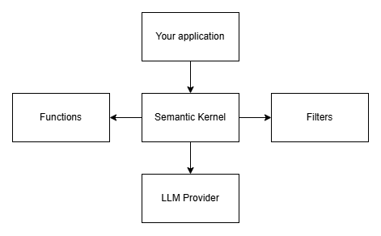
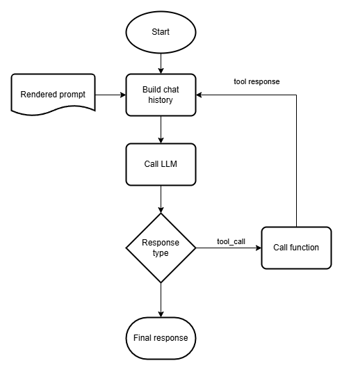

## 🧾 What's Semantic Kernel and why should you use it?

Working with an LLM can be tricky, especially when building more complex scenarios, such
as an agent with tools, search capabilities, or a workflow that uses multiple language
models. This is where Semantic Kernel comes into play.

### Semantic Kernel architecture

Semantic Kernel is a library that abstracts the behavior of LLMs so that you don't have
to worry about what each API looks like. It also abstracts using tools or functions
with the LLM. You can picture Semantic Kernel as having a central kernel that gives
access to LLMs, tools/functions, and filters.

### Tool calling in Semantic Kernel

Earlier we mentioned tools as a powerful way of letting your LLM-based application
interact with its environment. The workflow for calling a tool is rather cumbersome, so
Semantic Kernel automates this process. It uses the following workflow when calling
tools for you.

You can control what tools the kernel can call at any time. You can even disable tool
calling if you want to. We'll explore tool calling in greater depth in later modules in
the workshop.